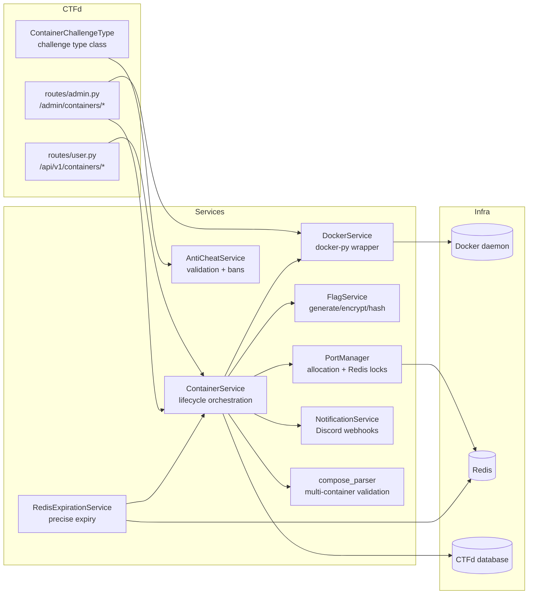
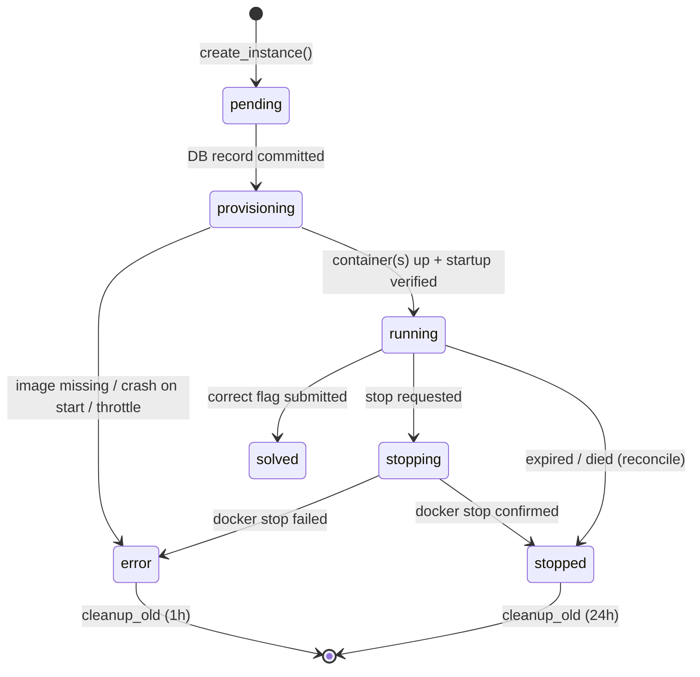

# Architecture

How the plugin is put together, how an instance lives and dies, and which
background processes keep the platform consistent.

## Component Map

## Data Model

| Model | Table | Purpose |
|-------|-------|---------|
| `ContainerChallenge` | `container_challenge` (joined inheritance from `challenges`) | Challenge config: image or `compose_yaml`, ports, command, capabilities, flag pattern, scoring, per-challenge resource overrides |
| `ContainerInstance` | `container_instances` | One row per spawned instance: owner account, container id(s), connection info, flag (encrypted + hashed), status, expiry |
| `ContainerFlag` | `container_flags` | Per-instance flag hash for anti-cheat (random flag mode only); unique `flag_hash` |
| `ContainerFlagAttempt` | `container_flag_attempts` | Every submission attempt, incl. cheat flagging |
| `ContainerAuditLog` | `container_audit_logs` | Full event trail (lifecycle, submissions, cheat detections) |
| `ContainerConfig` | `container_config` | Key-value plugin settings |

Schema upgrades on existing databases are handled by `_ensure_schema()` in
`__init__.py` — `create_all()` cannot ALTER existing tables, so new columns
are added explicitly (idempotent, runs at every plugin load).

## Instance Lifecycle

Notes:
- `running` is only entered after **startup verification**: the container is
  watched for ~5s; `exited`/`dead`/`removing` (auto_remove race) counts as a
  failed start and surfaces the last log lines in the error.
- A failed `docker stop` never fakes success — the instance goes to `error`
  and the reconcile job retries cleanup, so containers are never silently
  orphaned as "stopped".

## Provisioning Flow

1. **Guards**: challenge exists, not already solved, per-account concurrent
   limit (user route), **global provisioning throttle** (semaphore,
   `max_concurrent_provisions`, default 4).
2. **Flag**: generated (`FlagService`), encrypted on the instance, hashed for
   lookup; random-mode flags also get a `ContainerFlag` row for anti-cheat.
3. **Ports**: allocated from the configured range; a short Redis lock (60s)
   covers the window between allocation and DB commit; long-term ownership is
   derived from active instance rows.
4. **Container(s)**:
   - *Single-image mode*: one container on the shared `ctfd-isolated`
     network (ICC disabled — instances cannot reach each other), or the
     Traefik network when subdomain routing is enabled.
   - *Compose mode*: a **dedicated bridge network** `ctfd-inst-<uuid8>` is
     created; services start in `depends_on` order, each with a network
     alias equal to its service name (service discovery via Docker DNS).
   - All containers: `auto_remove`, `cap_drop=ALL` (+ whitelisted
     `cap_add`), `no-new-privileges`, memory/CPU/PIDs limits, `FLAG` env,
     `{FLAG}` substitution in command/environment, management labels.
5. **Verification** then `running` + Redis expiration key.

Images are **never pulled during provisioning** — docker-py would block a
web worker for minutes. Missing images fail fast; admins pull via the
settings page (background thread + status polling).

### Container labels

| Label | Meaning |
|-------|---------|
| `ctfd.managed=true` | Created by this plugin |
| `ctfd.deployment` | ID of this CTFd deployment (multi-CTFd on one Docker host) |
| `ctfd.instance_uuid` | Owning instance |
| `ctfd.challenge_id` / `ctfd.account_id` | Ownership metadata |
| `ctfd.service` | Compose service name (compose mode only) |

`list_managed_containers()` filters on `ctfd.managed` **and** the deployment
ID, so reconciliation can never touch another deployment's containers.
Per-instance networks carry the same labels.

## Expiration — two independent paths

1. **Redis keyspace notifications** (precise): a `container:expire:<uuid>`
   key with TTL is set at start; a listener thread subscribed to
   `__keyevent@<db>__:expired` stops the instance the second the key expires.
   Renewals extend the TTL (and the DB expiry) additively.
2. **APScheduler backup poller** (1 min): catches anything the listener
   missed (Redis restart, missed event, listener down).

## Background jobs (APScheduler)

| Job | Interval | What it does |
|-----|----------|--------------|
| `cleanup_expired` | 1 min | Stops instances whose `expires_at` passed (Redis backup path) |
| `recover_stale` | 1 min | Fails instances stuck in `pending`/`stopping` (>5 min) or `provisioning` (>10 min) |
| `reconcile_docker` | 1 min | DB ⇄ Docker sync: instances with missing containers → `died`; orphaned containers/networks → removed. Compose instances count **all** services — one dead service marks the whole instance died |
| `infra_check` | 1 min | Discord alerts: Docker unreachable, port pool ≤5% free (15-min cooldown per alert type) |
| `cleanup_old` | 1 h | Deletes `stopped` rows older than 24h and `error` rows older than 1h |

The user-facing `info` endpoint additionally self-heals on read: if the DB
says `running` but Docker definitively reports the container gone, the
instance is closed immediately so the player can fetch a fresh one.

## Flags & Anti-Cheat

- **Static mode**: flag is `prefix + suffix`, compared directly.
- **Random mode**: `prefix + random + fingerprint + suffix`, where the total
  random section is **exactly `random_flag_length` characters**; the last
  `min(8, N//2)` of them are an HMAC fingerprint of `(account, challenge)` —
  deterministic per account, so two accounts can never draw the same flag
  (a collision would otherwise trip the anti-cheat against an innocent team).
- Validation hashes the submission and looks it up in `container_flags`:
  - owner's own active flag → solve (instance auto-stops)
  - another account's flag → **cheat**: both accounts (and all team members
    in team mode) are banned, audit entry + Discord alert fire
  - invalidated flag (expired instance) → "This flag has expired"
- On non-solved stops the temporary flag row is deleted, so a fresh instance
  (or Restart) issues a new flag.

## Frontend integration

- `assets/view.{html,js}` — challenge modal: Fetch/Extend/Restart/Terminate,
  connection rendering (single/multi-port, subdomain URLs), copy-to-clipboard,
  expiry ticker. Emits `containers:changed` on state changes.
- `assets/board.js` — injected globally (`register_plugin_script`); colors
  challenge tiles that have an active instance (`/api/v1/containers/running`),
  refreshed every 20s and instantly via `containers:changed`.
- `assets/create.{html,js}` / `update.{html,js}` — admin challenge forms,
  incl. flag-pattern preview, capabilities grid, resource limits, compose
  textarea.
